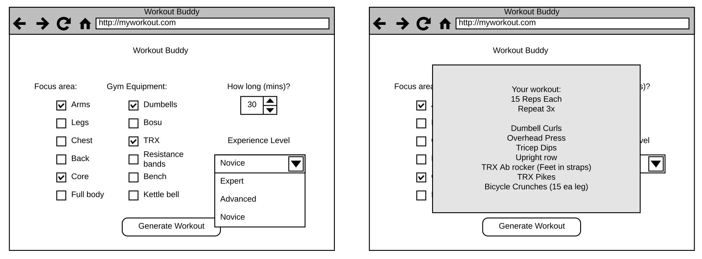

# csci3308_team2_finalproject
Final Project for CSCI 3308 Spring 2019.

# Customized Workout Generator

## Team
 - Lauren Deans
 - Christina Holt
 - Bret Murray
 - Derek Sessions

## Vision Statement
We will provide a web application that will be a tool for guiding the bored workout enthusiast. The user will provide input parameters such length of workout, equipment to use, and body target area, which will be used to generate a custom workout that help them meet their workout goals for the day.

With plenty of room for expansion, we can add descriptions/pictures/video for exercise catalog, provide options for printing/emailing, and adding "memory" such that we can track users' goals, past workouts, and favorites.

## Motivation
We are all interested in using an excercise tool similar to the one we've devised. The scope of the project seems to be achievable given our restraints: time, experience, and platform. Also, Lauren has an Excercise Science Degree. Since we share common interest, and have an expert on the team, we have decided to use that to our advantage. 

## Constraints/requirements

- User experience will be of paramount importance. Nobody will want to utilize this tool if it's too cumbersome, or takes too long. Being able to click a few
buttons, or choose from a drop down will make the final product better. Using efficient database management for the backend system will keep the time spent
using the tool at a minimum.
- Must be mobile site friendly. While some people plan workouts in advance, it is more useful to have access on a mobile device. An app is outside the scope of
this project.
- Must provide ways of exporting the workout for use offline. Planning ahead while using wifi should be supported.

## Risks

- First time the team has worked together. Gathering everyone on a regular basis could be difficult.
- Deterimining the source of our excercise database. Creating our own could lead to difficulties. We could tackle the problem with brute force given enough time and prioritizing the monotonous data entry. We don't know what open-source information exists for exercise databases and how we may be able to levereage existing databases. 
- No experience with this type of web application project. 

## Mitigation strategies

- Devote more effort to checking in on various lines of communications. Regularly scheduled meetings. 
- Start with a small excercise database as early as possible. Prioritize finding this information to address the problem as early as possible.
-  Study hard, practice, Google it. Learn together and communicate regularly. Ask questions on Piazza or StackOverflow.

## Development Method

Apply Agile methods appropriate for our busy schedules. We plan to incorporate regular video meetings, and a Trello board for Kanban tracking. 

- Weekly tag-up to discuss our achievements for the week, and our upcoming tasks. An evening later in the week is ideal for the group since it goes along with our typical Monday "end of week" schedule. 
- Definining sprints two weeks at a time to coincide with Milestones.
- Individually, we check in and update Trello board frequently. Follow work through email notifications. 
- Communication channels through both Slack and email until things become more stable.

## Project Tracking Software
Trello, Slack, GitHub

## User stories

As an inexperienced workout user, I'd like to navigate to the webpage, enter my desired length of workout and target areas and get guidance on the sets, reps,
	 and exercises I should accomplish during my alotted time. If I have some workout equipment, I'd like to be able to incorporate that into the guidance that I
	 receive. I may not know how to properly perform each exercise, so short explanations and/or tutorials should be readily available for each exercise. It may
	 also be helpful to have a list of synonyms for excercises to clear terminology related confusion. 

As an experienced user, I want to add a bit of variety to my workout routine. I'd like to click on an area of the body, click on my exercise equipment, and
	 choose an interval workout using Tabata timing. Once I provide the constraints, I want a list of exercises to incorporation during my workout. Short descriptions or
	 pictures would be helpful to make sure I am familiar with the exercise. A link to a YouTube tutorial would be helpful. 

As a developer, I'd like to be able to add new exercises to the database and have them automatically begin to be incorporated into the randomized output. I'd
also like to add the option to query the database by a new tag without much additional development on the backend. An example is adding in the option to limit
the returned exercises to those that use a certain piece of gym equipment where gym equipment had not previously been a parameter for the search. I'd expect
that I could simply add a new drop down menu for users no the front end and connect the choice to the interface of the query engine.

## Basic website design

